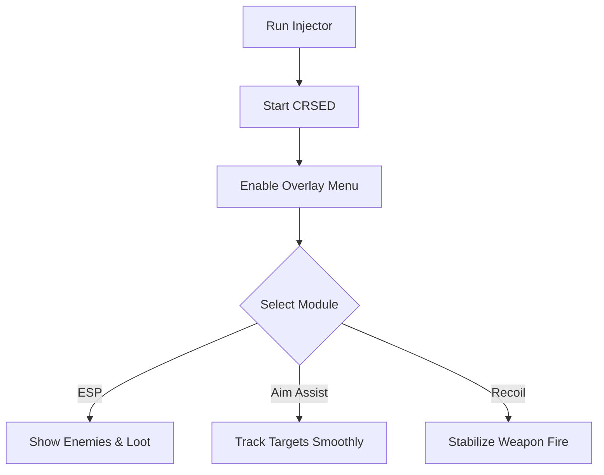

# CRSED Cheat 🔥

The **CRSED Cheat Software** is designed for players who want to maximize awareness and sharpen their combat control in this chaotic battle royale. With **ESP overlays, aim assist modules, and loot filters**, it provides the tools to refine tactics, train builds, and enjoy complete control in private or offline play.

---

## 📝 Overview

CRSED (Cuisine Royale: Second Edition) mixes fast-paced combat with survival mechanics. Hidden enemies, scattered loot, and unpredictable firefights can overwhelm even experienced players. This cheat software ensures you always have the upper hand by showing **real-time enemy, loot, and objective data**—while balancing combat with customizable aim assist.

\[!WARNING]
Intended for **offline or private training only**. Do not use in competitive environments.

[](#)
[](#)
[](#)
[](#)

---

## ⭐ Features

* **Enemy ESP** – Highlight enemy positions, names, and distances.
* **Loot ESP** – Show rare weapons, armor, and consumables on the map.
* **Aim Assist Module** – Smooth lock-on with customizable FOV and sensitivity.
* **Recoil Control** – Reduce weapon kick for cleaner shots.
* **Overlay Menu** – Manage features live without leaving the game.
* **Config Profiles** – Save setups for different weapon types or playstyles.

---

## 🖥 Compatibility

| Platform           | Supported | Notes                |
| ------------------ | --------- | -------------------- |
| Windows 10/11      | ✅         | Fully supported      |
| Steam              | ✅         | Stable overlay build |
| Linux (Proton)     | ⚠️        | Limited testing      |
| Consoles (Xbox/PS) | ❌         | Not supported        |

\[!NOTE]
Accessibility: ESP colors, text size, and overlay transparency can all be customized.

---

## ⚡ Setup Guide

1. **Download** the CRSED Cheat package.
2. Extract files into your CRSED root folder.
3. Run `CRSEDInjector.exe` as administrator.
4. Launch the game and press `INSERT` to activate overlay.
5. Adjust ESP and aim configs via the in-game menu or `config.ini`.

```ini
[esp]
enemy=red
loot=yellow
armor=blue
show_distance=true

[aim]
fov=80
smooth=5
recoil_control=true
hotkey=VK_RBUTTON
```

---

## 🔄 Cheat Workflow



---

## ❓ FAQ

**Q: Does this alter game saves?**
A: No, it runs in memory only.

**Q: Can I use it in online lobbies?**
A: It is built for **offline and private training**.

**Q: Will performance drop with ESP enabled?**
A: No, the tool is optimized for low overhead.

**Q: Can I change ESP visuals?**
A: Yes, colors and markers are fully customizable.

**Q: Can I create weapon-specific configs?**
A: Absolutely—profiles let you save different setups per weapon.

---

## 🚀 Final Thoughts

The **CRSED Cheat Software** blends **ESP overlays, loot tracking, aim assist, and recoil control** to give players a full awareness toolkit. It’s perfect for practicing strategies, testing weapon loadouts, or exploring the game without restrictions.

---


